# Implementation Backlog

Each item is a dedicated GitHub issue, branch, and pull request targeting `main`. Arrows mean “must
be completed before.” Cross-cutting authorization, provenance, safety, observability, testing, and
documentation requirements apply to every item.

```mermaid
flowchart LR
  I1["#1 Foundation"] --> I2["#2 Database"] --> I3["#3 Authentication"] --> I4["#4 RBAC"]
  I4 --> I5["#5 Upload"] --> I6["#6 Processing"] --> I7["#7 OCR"] --> I8["#8 Chunking"]
  I8 --> I9["#9 Normalization"] --> I10["#10 Embeddings"] --> I11["#11 Retrieval"] --> I12["#12 Reranking"]
  I12 --> I13["#13 RAG"] --> I14["#14 Citations"] --> I15["#15 Verification"] --> I16["#16 Abstention"]
  I16 --> I17["#17 Injection defence"] --> I18["#18 Hardening"]
  I4 --> I19["#19 Auth/RBAC UI"] --> I20["#20 Documents UI"] --> I21["#21 Chat/evidence UI"]
  I17 --> I22["#22 Evaluation"]
  I21 --> I22 --> I23["#23 Testing"] --> I24["#24 Observability"] --> I25["#25 Deployment"] --> I26["#26 Final docs"]
  I18 --> I25
```

The canonical scope and acceptance criteria are maintained in
[GitHub issues #1–#26](https://github.com/imthi16/nambikkai-guardian/issues).
